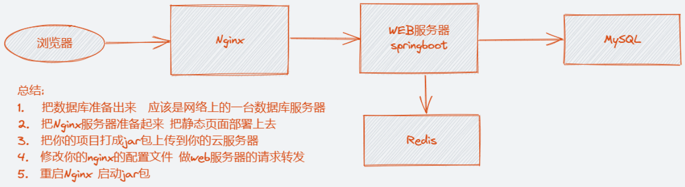

## 瑞吉外卖项目介绍

### 项目介绍


本项目（瑞吉外卖）是专门为餐饮企业（餐厅、饭店）定制的一款软件产品，包括 系统管理后台 和 移动端应用 两部分。其中系统管理后台主要提供给餐饮企业内部员工使用，可以对餐厅的分类、菜品、套餐、订单、员工等进行管理维护。移动端应用主要提供给消费者使用，可以在线浏览菜品、添加购物车、下单等。


本项目共分为3期进行开发：

| 阶段   | 功能实现                                                     |
| ------ | ------------------------------------------------------------ |
| 第一期 | 主要实现基本需求，其中移动端应用通过H5实现，用户可以通过手机浏览器访问 |
| 第二期 | 主要针对移动端应用进行改进，使用微信小程序实现，用户使用起来更加方便 |
| 第三期 | 主要针对系统进行优化升级，提高系统的访问性能                 |


### 产品原型

**1. 管理端**

餐饮企业内部员工使用。 主要功能有: 

| 模块      | 描述                                                         |
| --------- | ------------------------------------------------------------ |
| 登录/退出 | 内部员工必须登录后,才可以访问系统管理后台                    |
| 员工管理  | 管理员可以在系统后台对员工信息进行管理，包含查询、新增、编辑、禁用等功能 |
| 分类管理  | 主要对当前餐厅经营的 菜品分类 或 套餐分类 进行管理维护， 包含查询、新增、修改、删除等功能 |
| 菜品管理  | 主要维护各个分类下的菜品信息，包含查询、新增、修改、删除、启售、停售等功能 |
| 套餐管理  | 主要维护当前餐厅中的套餐信息，包含查询、新增、修改、删除、启售、停售等功能 |
| 订单明细  | 主要维护用户在移动端下的订单信息，包含查询、取消、派送、完成，以及订单报表下载等功能 |

**2. 用户端**

移动端应用主要提供给消费者使用。主要功能有:

| 模块        | 描述                                                         |
| ----------- | ------------------------------------------------------------ |
| 登录/退出   | 在移动端, 用户也需要登录后使用APP进行点餐                    |
| 点餐-菜单   | 在点餐界面需要展示出菜品分类/套餐分类, 并根据当前选择的分类加载其中的菜品信息, 供用户查询选择 |
| 点餐-购物车 | 用户选中的菜品就会加入用户的购物车, 主要包含 查询购物车、加入购物车、删除购物车、清空购物车等功能 |
| 订单支付    | 用户选完菜品/套餐后, 可以对购物车菜品进行结算支付, 这时就需要进行订单的支付 |
| 个人信息    | 在个人中心页面中会展示当前用户的基本信息, 用户可以管理收货地址, 也可以查询历史订单数据 |


### 技术选型


**1. 用户层**

本项目中在构建系统管理后台的前端页面，我们会用到H5、Vue.js、ElementUI等技术。而在构建移动端应用时，我们会使用到微信小程序。


**2. 网关层**

Nginx是一个服务器，主要用来作为Http服务器，部署静态资源，访问性能高。在Nginx中还有两个比较重要的作用： 反向代理和负载均衡， 在进行项目部署时，要实现Tomcat的负载均衡，就可以通过Nginx来实现。


**3. 应用层**

SpringBoot： 快速构建Spring项目, 采用 "约定优于配置" 的思想, 简化Spring项目的配置开发。

Spring: 统一管理项目中的各种资源(bean), 在web开发的各层中都会用到。

SpringMVC：SpringMVC是spring框架的一个模块，springmvc和spring无需通过中间整合层进行整合，可以无缝集成。

SpringSession: 主要解决在集群环境下的Session共享问题。

lombok：能以简单的注解形式来简化java代码，提高开发人员的开发效率。例如开发中经常需要写的javabean，都需要花时间去添加相应的getter/setter，也许还要去写构造器、equals等方法。

Swagger： 可以自动的帮助开发人员生成接口文档，并对接口进行测试。


**4. 数据层**

MySQL： 关系型数据库, 本项目的核心业务数据都会采用MySQL进行存储。

MybatisPlus： 本项目持久层将会使用MybatisPlus来简化开发, 基本的单表增删改查直接调用框架提供的方法即可。

Redis： 基于key-value格式存储的内存数据库, 访问速度快, 经常使用它做缓存(降低数据库访问压力, 提供访问效率), 在后面的性能优化中会使用。


**5. 工具**

git: 版本控制工具, 在团队协作中, 使用该工具对项目中的代码进行管理。

maven: 项目构建工具。

junit：单元测试工具，开发人员功能实现完毕后，需要通过junit对功能进行单元测试。


### 功能架构


**1. 移动端前台功能**

手机号登录 , 微信登录 , 收件人地址管理 , 用户历史订单查询 , 菜品规格查询 , 购物车功能 , 下单 , 分类及菜品浏览。

**2. 系统管理后台功能**

员工登录/退出 , 员工信息管理 , 分类管理 , 菜品管理 , 套餐管理 , 菜品口味管理 , 订单管理 。


### 角色

在瑞吉外卖这个项目中，存在以下三种用户，这三种用户对应三个角色：后台系统管理员、后台系统普通员工、C端(移动端)用户。

| 角色             | 权限操作                                                     |
| ---------------- | ------------------------------------------------------------ |
| 后台系统管理员   | 登录后台管理系统，拥有后台系统中的所有操作权限               |
| 后台系统普通员工 | 登录后台管理系统，对菜品、套餐、订单等进行管理 (不包含员工管理) |
| C端用户          | 登录移动端应用，可以浏览菜品、添加购物车、设置地址、在线下单等 |

------

## 开发环境搭建

### 数据库环境搭建

#### 创建数据库

> 注意: 本项目数据库的字符串, 选择 utf8mb4

本项目数据库sql语句在项目文件下


#### 数据表介绍

本项目涉及到的数据表如下

| **序号** | **表名**      | **说明**         |
| -------- | ------------- | ---------------- |
| 1        | employee      | 员工表           |
| 2        | category      | 菜品和套餐分类表 |
| 3        | dish          | 菜品表           |
| 4        | setmeal       | 套餐表           |
| 5        | setmeal_dish  | 套餐菜品关系表   |
| 6        | dish_flavor   | 菜品口味关系表   |
| 7        | user          | 用户表（C端）    |
| 8        | address_book  | 地址簿表         |
| 9        | shopping_cart | 购物车表         |
| 10       | orders        | 订单表           |
| 11       | order_detail  | 订单明细表       |


### Maven项目搭建

#### 创建maven项目

1. 在idea中创建maven project
2. 检查项目编码（设置均为UTF-8）
3. 检查maven配置
4. 检查JDK版本（JDK的版本选择1.8）


#### 搭建基础环境

1. 在`pom.xml`中导入依赖
2. 在工程的resources目录下创建`application.yml`文件,并引入配置
3. 编写启动类`App.class`

```java
@SpringBootApplication
@MapperScan("com.itheima.mapper")
@EnableTransactionManagement
@Slf4j
public class App {
    public static void main(String[] args) {
        SpringApplication.run(App.class, args);
        log.info("项目启动成功...");
    }

    @Bean
    public MybatisPlusInterceptor mybatisPlusInterceptor() {
        MybatisPlusInterceptor mybatisPlusInterceptor = new MybatisPlusInterceptor();
        mybatisPlusInterceptor.addInnerInterceptor(new PaginationInnerInterceptor(DbType.MYSQL));
        return mybatisPlusInterceptor;
    }
}
```

> @Slf4j : 
>
> 是lombok中提供的注解, 用来通过slf4j记录日志。

当搭建完上述的基础环境之后, 就可以通过引导类, 启动该项目。


#### 前端静态资源导入

本项目的前端代码已经提供，不需要编写，只要能看懂即可，后续需要查看前端需要的数据，定义一些数据。


直接将静态资源bacakend和front文件放到static目录文件下

Spring Boot 默认就配置了`/static/**`映射，所以无需任何配置就能访问此目录下的静态资源

> 在Springboot项目中, 默认静态资源的存放目录为 : "classpath:/resources/", "classpath:/static/", "classpath:/public/"

如果不将文件存放在springboot默认配置的加载目录，那么这个时候想要访问到静态资源，就要设置静态资源映射。

```java
import lombok.extern.slf4j.Slf4j;
import org.springframework.context.annotation.Configuration;
import org.springframework.web.servlet.config.annotation.ResourceHandlerRegistry;
import org.springframework.web.servlet.config.annotation.WebMvcConfigurationSupport;

@Slf4j
@Configuration
public class WebMvcConfig extends WebMvcConfigurationSupport {
    /**
     * 设置静态资源映射
     * @param registry
     */
    @Override
    protected void addResourceHandlers(ResourceHandlerRegistry registry) {
        log.info("开始进行静态资源映射...");
        registry.addResourceHandler("/backend/**").addResourceLocations("classpath:/backend/");
        registry.addResourceHandler("/front/**").addResourceLocations("classpath:/front/");
    }
}
```


### 基础类导入

#### 实体类导入

创建实体类包，将所有实体类直接导入


#### vo和dto导入


> VO（View Object）：视图对象，用于展示层，它的作用是把某个指定页面（或组件）的所有数据封装起来。通常起的类名会加上VO。
>
> DTO（Data Transfer Object）：泛指用于展示层与服务层之间的数据传输对象。用于Controller中接收的参数较多时，定义一个对象专门用于接收这些对象。

------

## 业务逻辑

### 后台系统登录

1. 判断传入的参数是否合法
2. 判断用户名或密码是否为空
3. 根据用户名查询一个Emp对象
4. 判断用户名对应的用户是否存在
5. 对输入的密码进行MD5加密
6. 将加密后的密码与数据库中查询到的进行比较
7. 返回登陆成功数据

```java
/**
 * 员工登陆业务
 * @param employee 员工
 * @return R
 */
@Override
public R login(Employee employee) {
    // 判断传入的参数是否合法
    if (ObjectUtil.isNull(employee)) return R.error("参数不合法");

    // 判断用户名或密码是否为空
    if (StrUtil.hasEmpty(employee.getUsername(), employee.getPassword())) return R.error("用户名或密码不能为空");

    // 根据用户名查询一个Emp对象
    Employee one = this.getOne(Wrappers.lambdaQuery(Employee.class)
            .eq(Employee::getUsername, employee.getUsername()));

    // 判断用户名对应的用户是否存在
    if (ObjectUtil.isNull(one)) return R.error("用户名或密码错误");

    // 对输入的密码进行MD5加密
    String md5 = SecureUtil.md5(employee.getPassword());
    // 将加密后的密码与数据库中查询到的进行比较
    if (!StrUtil.equals(md5, one.getPassword(), true)) return R.error("用户名或密码错误");

    // 返回登陆成功数据
    return R.success(one);
}
```


### 新增员工功能

1. 判断传入的参数是否合法
2. 判断手机号码格式
3. 判断身份证号码格式
4. 判断用户名是否被占用
5. 设置初始密码123456，使用MD5加密
6. 设置更新时间和新建时间，此处使用Mybatis Plus的自动填充

```java
@Override
public R addEmployee(Employee employee) {
    // 判断传入的参数是否合法
    if (ObjectUtil.isNull(employee)) return R.error("参数不合法");

    if (ObjectUtil.hasEmpty(employee.getName(), employee.getUsername(), employee.getPhone(),
            employee.getIdNumber())) return R.error("参数不合法");

    // 判断手机号码格式
    if (!PhoneUtil.isMobile(employee.getPhone())) return R.error("手机号码格式不正确");

    // 判断身份证号码格式
    if (!IdcardUtil.isValidCard(employee.getIdNumber())) return R.error("身份证号码格式不正确");

    // 判断用户名是否被占用
    Employee one = this.getOne(Wrappers.lambdaQuery(Employee.class).eq(Employee::getUsername, employee.getUsername()));
    if (ObjectUtil.isNotNull(one)) return R.error("用户名已被占用");

    // 设置初始密码123456 使用MD5加密
    employee.setPassword(SecureUtil.md5("123456"));

    // 自动填充代替
    // employee.setCreateTime(LocalDateTime.now());
    // employee.setUpdateTime(LocalDateTime.now());
    // employee.setCreateUser(EmpThreadLocal.get().getId());
    // employee.setUpdateUser(EmpThreadLocal.get().getId());

    if (this.save(employee)) {
        return R.builder().code(1).msg("添加成功").data("添加成功").build();
    }

    return R.error("添加失败，请稍后重试");
}
```

#### 格式判断-工具包的使用

此处参数校验的时候，需要多处校验手机号，身份证等是否合法。当然可以自定义正则校验完成，但是提供相应功能的工具包有很多（能偷懒谁自己写啊🥱），此处使用的是hutool工具包，只需要在pom.xml中添加依赖就行。


### 修改时判断用户名重复

1. 通过id找到数据库中的对象
2. 判断数据库中的对象的名字与当前传入对象的名字是否相同
3. 如果不同，说明修改了用户名，则需要判断修改后的用户名在数据库中是否有重名对象

```java
Employee oldEmp = this.getById(employee);
if (!StrUtil.equals(oldEmp.getUsername(), employee.getUsername())) {
    Employee one = this.getOne(Wrappers.lambdaQuery(Employee.class).eq(Employee::getUsername, employee.getUsername()));
    // 如果业务允许修改用户名，得先判断用户输入的用户名是否和之前一样
    if (ObjectUtil.isNotNull(one)) return R.error("用户名已被占用");
}
```


### 文件的上传和下载

在添加菜品时，涉及到图片的上传操作，以下是一般流程

文件上传前的必须操作

1. 校验

   校验文件是否为空

   校验文件的格式

   校验文件的大小

2. 给文件进行重命名

3. 给文件目录分离

   使用目录分离算法(Hash 把hash值作为目录名称)

   按照日期分目录(每天创建一个新的目录)

   按照用户名分目录

4. 图片保存地点

   web服务器（项目所运行在的电脑） 

   云存储服务商

   自己搭建文件服务器（FastDIS Minio）

```java
package com.itheima.controller;

import cn.hutool.core.io.FileUtil;
import cn.hutool.core.lang.UUID;
import cn.hutool.core.util.ObjectUtil;
import cn.hutool.core.util.StrUtil;
import com.itheima.vo.R;
import org.springframework.web.bind.annotation.GetMapping;
import org.springframework.web.bind.annotation.PostMapping;
import org.springframework.web.bind.annotation.RequestMapping;
import org.springframework.web.bind.annotation.RestController;
import org.springframework.web.multipart.MultipartFile;

import javax.servlet.ServletOutputStream;
import javax.servlet.http.HttpServletResponse;
import java.io.File;
import java.io.FileInputStream;
import java.io.IOException;

/**
 * @author zyf
 * @program: reggie_take_out
 * @description:
 * @date 2022-09-16 11:38:44
 */
@RestController
@RequestMapping("common")
public class CommonController {

    @PostMapping("upload")
    public R uploadPic(MultipartFile file) throws IOException {
        // 校验
        // 校验文件是否为空
        if (ObjectUtil.isNull(file)) return R.error("上传文件不能为空");
        // 校验文件的格式
        if (!StrUtil.containsAnyIgnoreCase(FileUtil.getSuffix(file.getOriginalFilename()), "jpg", "png")) {
            return R.error("上传文件格式错误");
        }
        // 校验文件的大小
        if (file.getSize() / 1024 / 1024 > 2) return R.error("文件过大，限制在2MB以内");
        // 给文件进行重命名
        String fileName = UUID.fastUUID().toString() + "." + FileUtil.getSuffix(file.getOriginalFilename());
        // 给文件目录分离
        // 图片保存地点 web服务器（项目所运行在的电脑） 云存储服务商 自己搭建文件服务器（FastDIS Minio）

        /* 如果我们把图片保存到当前电脑的其他盘符的其他目录下(非项目的static目录) */
        /* 那么就需要使用编码的方式去读取这个文件流 并且通过Response响应这个流 */
        /* 但是如果我们把图片保存到当前这个项目的static目录中 就可以直接返回一个访问这个图片的地址字符串 */
        file.transferTo(new File("D:\\Develop\\workspace\\reggie\\reggie_take_out\\src\\main\\resources\\static\\images\\" + fileName));
        return R.success(fileName);
    }

    @GetMapping("download")
    public void downloadPic(String name, HttpServletResponse response) throws IOException {
        FileInputStream fileInputStream = new FileInputStream("D:\\Develop\\workspace\\reggie\\reggie_take_out\\src\\main\\resources\\static\\images\\" + name);
        ServletOutputStream outputStream = response.getOutputStream();

        byte[] bytes = new byte[1024];
        int len = 0;
        while ((len = fileInputStream.read(bytes)) != -1) {
            outputStream.write(bytes, 0, len);
        }

        fileInputStream.close();
        outputStream.close();
    }
}
```

**文件上传相关：**


### 发送短信

前台用户采用验证码登陆的方式，这里验证码发送采用连接阿里云实现。

1. 集成阿里云平台

   申请签名

   申请模板 （即短信的内容） （一个签名可以对应多个模板）

   配置AK和SK （推荐使用子账户AK，配置权限）

1. pom.xml文件中添加依赖

```xml
<!--阿里云短信发送-->
<dependency>
    <groupId>com.aliyun</groupId>
    <artifactId>aliyun-java-sdk-dysmsapi</artifactId>
    <version>1.1.0</version>
</dependency>
<dependency>
    <groupId>com.aliyun</groupId>
    <artifactId>aliyun-java-sdk-core</artifactId>
    <version>4.6.0</version>
</dependency>
```

2. 用户登陆Service层代码如下：

```java
@Override
public R sendMsg(String phone) {
    if (!PhoneUtil.isMobile(phone)) return R.error("手机号码不合法");
    
    // 生成6位验证码
    String code = RandomUtil.randomNumbers(6);
    // 测试通过后不再发送验证码，采用随机生成数据，控制台输出的方式进行后续测试。
    SMSUtils.sendSM(phone,code);
    /*System.out.println("code = " + code);*/
    
    redisTemplate.opsForValue().set(phone + "_CODE", code);
    return R.success(code);
}
```

3. 发送验证码的SMSUtils代码如下

```java
package com.itheima.utils;

import com.aliyuncs.DefaultAcsClient;
import com.aliyuncs.IAcsClient;
import com.aliyuncs.dysmsapi.model.v20170525.SendSmsRequest;
import com.aliyuncs.dysmsapi.model.v20170525.SendSmsResponse;
import com.aliyuncs.exceptions.ClientException;
import com.aliyuncs.exceptions.ServerException;
import com.aliyuncs.profile.DefaultProfile;
import com.google.gson.Gson;

import java.io.IOException;
import java.util.Properties;

/**
 * 阿里云短信发送工具类
 *
 * @author yunfei
 * @date 2022年09月17日 14:54
 */
public class SMSUtils {

    /* DI的前提是当前的这个Bean要在容器中 */
    /*@Value("aliyun.sms.ak")
    private String ak;*/

    private static String ak;
    private static String sk;
    private static String signName;
    private static String templateCode;

    /* Java中通常都会使用类加载去读取文件 */
    static {
        try {
            Properties properties = new Properties();
            properties.load(SMSUtils.class.getClassLoader()
                            .getResourceAsStream("aliyun.properties"));
            ak = properties.getProperty("aliyun.sms.ak");
            sk = properties.getProperty("aliyun.sms.sk");
            signName = properties.getProperty("aliyun.sms.signName");
            templateCode = properties.getProperty("aliyun.sms.templateCode");
        } catch (IOException e) {
            e.printStackTrace();
        }
    }

    public static SendSmsResponse sendSM(String phoneNum, String code) {
        // 创建一个 Aliyun Acs Client, 用于发起 OpenAPI 请求
        DefaultProfile profile = DefaultProfile.getProfile("cn-hangzhou", ak, sk);
        IAcsClient client = new DefaultAcsClient(profile);

        // 创建一个 AssumeRoleRequest 并设置请求参数
        SendSmsRequest request = new SendSmsRequest();
        request.setPhoneNumbers(phoneNum);
        request.setSignName(signName);
        request.setTemplateCode(templateCode);
        request.setTemplateParam("{\"code\":\"" + code + "\"}");
        SendSmsResponse response = null;
        try {
            // 发起请求，并得到response
            response = client.getAcsResponse(request);
            System.out.println(new Gson().toJson(response));
            return response;
        } catch (ServerException e) {
            e.printStackTrace();
        } catch (ClientException e) {
            System.out.println("ErrCode:" + e.getErrCode());
            System.out.println("ErrMsg:" + e.getErrMsg());
            System.out.println("RequestId:" + e.getRequestId());
        }
        return response;
    }
}
```

4. 由于此工具类不想只依赖于springboot环境，因此采用读取properties文件的形式加载连接阿里云必要的信息。在工具类中采用静态代码块，读取配置类文件中的信息。

```properties
aliyun.sms.ak=LTAI5tHnZ8r3424CCbqFD1xZ
aliyun.sms.sk=bo0835BR3Pn8upjtQ0AcHz9vT4mV9Q
aliyun.sms.signName=\u676D\u5DDE\u9ED1\u9A6C\u4F20\u667A\u5065\u5EB7
aliyun.sms.templateCode=SMS_184110818
```


### 提交订单

本操作涉及的表较多，是本项目中业务逻辑最复杂的一个模块，但也很简单。

1. 设置订单默认参数
2. 获取购物车信息，==计算订单总金额==
3. 获取地址簿收货人信息， 设置订单中收货人的信息
4. 将购物车信息==拷贝==，插入订单明细
5. 存储信息
6. ❗清空购物车

```java
    @Override
    @Transactional
    public R submitOrder(Orders orders) {
        if (ObjectUtil.isNull(orders.getAddressBookId())) return R.error("参数不合法");

        // 使用雪花算法生成一个Id
        orders.setNumber(StrUtil.toString(IdWorker.getId()));
        // 设置订单状态 默认是4
        orders.setStatus(4);
        orders.setUserId(UserThreadLocal.get().getId());
        orders.setOrderTime(LocalDateTime.now());
        orders.setCheckoutTime(LocalDateTime.now());

        List<ShoppingCart> list = shoppingCartService.list(Wrappers.lambdaQuery(ShoppingCart.class)
                .eq(ShoppingCart::getUserId, UserThreadLocal.get().getId()));

        // 订单总金额
        BigDecimal sum = BigDecimal.ZERO;
        for (ShoppingCart shoppingCart : list) {
            BigDecimal amount = shoppingCart.getAmount().multiply(new BigDecimal(shoppingCart.getNumber()));
            sum = sum.add(amount);
        }

        // 设置金额
        orders.setAmount(sum);

        // 查询收货人信息
        AddressBook addressBook = addressBookService.getById(orders.getAddressBookId());

        orders.setPhone(addressBook.getPhone());
        orders.setAddress(addressBook.getDetail());
        orders.setUserName(UserThreadLocal.get().getName());
        orders.setConsignee(addressBook.getConsignee());

        this.save(orders);

        // 订单明细
        ArrayList<OrderDetail> orderDetails = new ArrayList<>();
        for (ShoppingCart shoppingCart : list) {
            OrderDetail detail = new OrderDetail();
            BeanUtils.copyProperties(shoppingCart, detail, "id");
            detail.setOrderId(orders.getId());
            orderDetails.add(detail);
        }

        orderDetailService.saveBatch(orderDetails);

        // 清空购物车
        shoppingCartService.remove(Wrappers.lambdaQuery(ShoppingCart.class)
                .eq(ShoppingCart::getUserId, UserThreadLocal.get().getId()));
        return R.success(orders);
    }
```

------

## 代码增强

### 自定义拦截器

1. 创建MVC配置类

```java
package com.itheima.config;

import com.itheima.interceptor.LoginCheckInterceptor;
import org.springframework.beans.factory.annotation.Autowired;
import org.springframework.context.annotation.Configuration;
import org.springframework.web.servlet.config.annotation.InterceptorRegistry;
import org.springframework.web.servlet.config.annotation.WebMvcConfigurer;

/**
 * @author zyf
 * @program: reggie_take_out
 * @description:
 * @date 2022-09-12 11:16:02
 */
@Configuration
public class MVCConfig implements WebMvcConfigurer{
    @Autowired
    private LoginCheckInterceptor loginCheckInterceptor;

    @Override
    public void addInterceptors(InterceptorRegistry registry) {
        // 注册拦截器， 对登录进行拦截，指定要拦截的请求（/**）
        registry.addInterceptor(loginCheckInterceptor).addPathPatterns("/**");
    }
}
```

2. 创建登录拦截器

```java
package com.itheima.interceptor;

import cn.hutool.core.text.AntPathMatcher;
import cn.hutool.core.util.ObjectUtil;
import cn.hutool.json.JSONUtil;
import com.itheima.domain.Employee;
import com.itheima.domain.User;
import com.itheima.utils.EmpThreadLocal;
import com.itheima.utils.UserThreadLocal;
import com.itheima.vo.R;
import org.springframework.stereotype.Component;
import org.springframework.web.method.HandlerMethod;
import org.springframework.web.servlet.HandlerInterceptor;
import org.springframework.web.servlet.ModelAndView;

import javax.servlet.http.HttpServletRequest;
import javax.servlet.http.HttpServletResponse;

/**
 * @author zyf
 * @program: reggie_take_out
 * @description:
 * @date 2022-09-12 10:45:58
 */
@Component
public class LoginCheckInterceptor implements HandlerInterceptor {

    @Override
    public boolean preHandle(HttpServletRequest request, HttpServletResponse response, Object handler) throws Exception {
        // 判断本次请求是否需要拦截
        if (!(handler instanceof HandlerMethod)) return true;

        if (request.getRequestURI().contains("employee/login")) return true;
        if (request.getRequestURI().contains("user/login")) return true;
        if (request.getRequestURI().contains("user/sendMsg")) return true;

        boolean employee = ObjectUtil.isNotNull(request.getSession().getAttribute("employee"));
        boolean user = ObjectUtil.isNotNull(request.getSession().getAttribute("user"));
        if (employee || user) {
            if (employee) EmpThreadLocal.set((Employee) request.getSession().getAttribute("employee"));
            if (user) UserThreadLocal.set((User) request.getSession().getAttribute("user"));
            return true;
        }

        // 设置状态码401
        response.setStatus(401);

        // 设置编码格式
        response.setContentType("application/json;charset=utf-8");

        response.getWriter().write(JSONUtil.toJsonStr(R.error("用户未登录")));

        // 判断是否登录，没有直接返回401
        return false;
    }

    /**
     * 请求回到浏览器之前执行
     * @param request request
     * @param response response
     * @param handler handler
     * @param modelAndView modelAndView
     * @throws Exception
     */
    @Override
    public void postHandle(HttpServletRequest request, HttpServletResponse response, Object handler, ModelAndView modelAndView) throws Exception {
        UserThreadLocal.remove();
        EmpThreadLocal.remove();
    }
}
```


自定义拦截器实现`HandlerInterceptor`，在此接口中有3个可以被重写的方法：

`preHandle(HttpServletRequest request, HttpServletResponse response, Object handler)`

> 拦截处理程序的执行。在 HandlerMapping 确定适当的处理程序对象之后，但在 HandlerAdapter 调用处理程序之前调用。 DispatcherServlet 处理执行链中的处理程序，该处理程序由任意数量的拦截器组成，处理程序本身位于最后。使用此方法，每个拦截器都可以决定中止执行链，通常是发送 HTTP 错误或编写自定义响应。注意：特殊注意事项适用于异步请求处理。

调用时间：Controller方法处理之前

执行顺序：链式Intercepter情况下，Intercepter按照声明的顺序一个接一个执行

若返回false，则中断执行，**注意：不会进入afterCompletion**


`postHandle(HttpServletRequest request, HttpServletResponse response, Object handler, @Nullable ModelAndView modelAndView)`

> 拦截处理程序的执行。在 HandlerAdapter 实际调用处理程序之后，但在 DispatcherServlet 呈现视图之前调用。可以通过给定的 ModelAndView 向视图公开其他模型对象。 DispatcherServlet 处理执行链中的处理程序，该处理程序由任意数量的拦截器组成，处理程序本身位于最后。使用此方法，每个拦截器都可以对执行进行后处理，以执行链的相反顺序应用。

调用前提：preHandle返回true

调用时间：Controller方法处理完之后，DispatcherServlet进行视图的渲染之前，也就是说在这个方法中你可以对ModelAndView进行操作

执行顺序：链式Intercepter情况下，Intercepter**按照声明的顺序倒着执行**。

备注：postHandle虽然post打头，但post、get方法都能处理


`afterCompletion(HttpServletRequest request, HttpServletResponse response, Object handler, @Nullable Exception ex)`

> 请求处理完成后的回调，即渲染视图后。将在处理程序执行的任何结果上调用，从而允许适当的资源清理。注意：仅当此拦截器的 preHandle 方法已成功完成并返回 true 时才会调用！与 postHandle 方法一样，该方法将在链中的每个拦截器上以相反的顺序调用，因此第一个拦截器将是最后一个被调用的拦截器。

调用前提：preHandle返回true

调用时间：DispatcherServlet进行视图的渲染之后

多用于清理资源


### ThreadLocal

> 在Java的多线程编程中，为保证多个线程对共享变量的安全访问，通常会使用synchronized来保证同一时刻只有一个线程对共享变量进行操作。这种情况下可以将[类变量](https://baike.baidu.com/item/%E7%B1%BB%E5%8F%98%E9%87%8F)放到ThreadLocal类型的对象中，使变量在每个线程中都有独立拷贝，不会出现一个线程读取变量时而被另一个线程修改的现象。最常见的ThreadLocal使用场景为用来解决数据库连接、Session管理等。在本项目中，被用于Session管理。

在拦截器的代码中，使用了两个ThreadLocal，在登录成功后，将用户数据存入Session，每次请求在拦截器中将Session中的数据存到对应的ThreadLocal中，方便后续线程使用。自定义ThreadLocal的代码如下：

```java
package com.itheima.utils;

import com.itheima.domain.Employee;

/**
 * @author zyf
 * @program: reggie_take_out
 * @description:
 * @date 2022-09-12 14:49:07
 */
public class EmpThreadLocal {
    private static final ThreadLocal<Employee> tl = new ThreadLocal<>();

    // 传递一个Employee对象，把对象绑定到线程
    public static void set(Employee employee) {
        tl.set(employee);
    }

    // 从当前线程上获取绑定EMP的对象
    public static Employee get() {
        return tl.get();
    }

    // 从当前线程上解绑EMP的对象
    public static void remove() {
        tl.remove();
    }
}
```

Servlet的运行是多线程的，但是应用服务器（这里指的是Tomcat）只会创建一个Servlet实例，这个实例被多个线程并发调用。每次调用doGet()方法，session可能被重置，导致存储混乱。ThreadLocal就是用于解决此问题。


### MybtisPlus自动填充

MybtisPlus提供自动填充的功能

1. 在需要填充的字段上方添加注解`@TableField(fill = FieldFill.INSERT)`

   需要在什么时候自动填充，FieldFill就选择什么

```java
/**
 * 创建时间
 */
@TableField(fill = FieldFill.INSERT)
private LocalDateTime createTime;

...
更新时间、创建人、修改人    
...
```

2. 实现MetaObjectHandler接口，重写对应的方法

```java
package com.itheima.config;

import cn.hutool.core.util.ObjectUtil;
import com.baomidou.mybatisplus.core.handlers.MetaObjectHandler;
import com.itheima.utils.EmpThreadLocal;
import com.itheima.utils.UserThreadLocal;
import org.apache.ibatis.reflection.MetaObject;
import org.springframework.stereotype.Component;

import java.time.LocalDateTime;

/**
 * @author zyf
 * @program: reggie_take_out
 * @description:
 * @date 2022-09-12 15:14:37
 */
@Component
public class MybatisPlusMetaObjectHandler implements MetaObjectHandler {

    // 当我们调用MP的新增方法时，会自动执行
    @Override
    public void insertFill(MetaObject metaObject) {
        // metaObject 我们调用新增方法时传递的对象
        if (metaObject.hasGetter("createTime") && ObjectUtil.isNull(getFieldValByName("createTime", metaObject)))
            setFieldValByName("createTime", LocalDateTime.now(), metaObject);
        if (metaObject.hasGetter("updateTime") && ObjectUtil.isNull(getFieldValByName("updateTime", metaObject)))
            setFieldValByName("updateTime", LocalDateTime.now(), metaObject);
        if (metaObject.hasGetter("createUser") && ObjectUtil.isNull(getFieldValByName("createUser", metaObject)))
            setFieldValByName("createUser", ObjectUtil.isNotNull(EmpThreadLocal.get()) ? EmpThreadLocal.get().getId() : UserThreadLocal.get().getId(), metaObject);
        if (metaObject.hasGetter("updateUser") && ObjectUtil.isNull(getFieldValByName("updateUser", metaObject)))
            setFieldValByName("updateUser", ObjectUtil.isNotNull(EmpThreadLocal.get()) ? EmpThreadLocal.get().getId() : UserThreadLocal.get().getId(), metaObject);
    }

    @Override
    public void updateFill(MetaObject metaObject) {
        if (metaObject.hasGetter("updateTime") && ObjectUtil.isNull(getFieldValByName("updateTime", metaObject)))
            setFieldValByName("updateTime", LocalDateTime.now(), metaObject);
        if (metaObject.hasGetter("updateUser") && ObjectUtil.isNull(getFieldValByName("updateUser", metaObject)))
            setFieldValByName("updateUser", ObjectUtil.isNotNull(EmpThreadLocal.get()) ? EmpThreadLocal.get().getId() : UserThreadLocal.get().getId(), metaObject);
    }
}
```


### MybatisPlus分页查询

> MybatisPlus提供的插件都将基于接口InnerInterceptor来实现功能，目前已有的功能包括分页查询。

1. 新建配置类，加入扫描。或直接在SpringBoot的启动类中配置如下代码：

```java
@Bean
public MybatisPlusInterceptor mybatisPlusInterceptor() {
    MybatisPlusInterceptor mybatisPlusInterceptor = new MybatisPlusInterceptor();
    mybatisPlusInterceptor.addInnerInterceptor(new PaginationInnerInterceptor(DbType.MYSQL));
    return mybatisPlusInterceptor;
}
```

2. 使用方法如下

```java
@Override
public R findEmployeeByPage(EmpPageDto empPageDto) {
    empPageDto.check();

    // 分页对象
    Page<Employee> pageInfo = new Page<>(empPageDto.getPage(), empPageDto.getPageSize());

    this.page(pageInfo,
            Wrappers.lambdaQuery(Employee.class)
              		// 添加分页筛选相关条件
                    .like(StrUtil.isNotEmpty(empPageDto.getName()), Employee::getName, empPageDto.getName())
              		// 添加分页排序条件
                    .orderByDesc(Employee::getUpdateTime));

    // 可以直接取出分页查询得到的结果集，然后对结果集进行操作，修改结果集中单个元素的属性
    
    return R.success(pageInfo);
}
```


### Long类型精度丢失

1. 在员工信息修改时，需要通过查找，实现信息回显

2. 修改过后，发现回显功能不能实现，查看数据库，原有的id被改变，最后四位变成了0。

   服务端会将返回的R对象进行json序列化，转换为json格式的数据，而员工的ID是一个Long类型的数据，而且是一个长度为 19 位的长整型数据， 该数据返回给前端是没有问题的。

   但是在前端JS中， js在对长度较长的长整型数据进行处理时， 会损失精度， 从而导致提交的id和数据库中的id不一致。

3. 修改实体类，在Long类型的属性上添加一行注释，让系统序列化时，保留相关精度。

```java
@JsonSerialize(using = ToStringSerializer.class)
```


### 对象映射器

上述修改需要在每处用到的地方添加注释，在资料中看见另一种方法

1. 提供对象转换器JacksonObjectMapper，基于Jackson进行Java对象到json数据的转换

```java
package com.itheima.mapper;

import com.fasterxml.jackson.databind.DeserializationFeature;
import com.fasterxml.jackson.databind.ObjectMapper;
import com.fasterxml.jackson.databind.module.SimpleModule;
import com.fasterxml.jackson.databind.ser.std.ToStringSerializer;
import com.fasterxml.jackson.datatype.jsr310.deser.LocalDateDeserializer;
import com.fasterxml.jackson.datatype.jsr310.deser.LocalDateTimeDeserializer;
import com.fasterxml.jackson.datatype.jsr310.deser.LocalTimeDeserializer;
import com.fasterxml.jackson.datatype.jsr310.ser.LocalDateSerializer;
import com.fasterxml.jackson.datatype.jsr310.ser.LocalDateTimeSerializer;
import com.fasterxml.jackson.datatype.jsr310.ser.LocalTimeSerializer;
import java.math.BigInteger;
import java.time.LocalDate;
import java.time.LocalDateTime;
import java.time.LocalTime;
import java.time.format.DateTimeFormatter;
import static com.fasterxml.jackson.databind.DeserializationFeature.FAIL_ON_UNKNOWN_PROPERTIES;

/**
 * 对象映射器:基于jackson将Java对象转为json，或者将json转为Java对象
 * 将JSON解析为Java对象的过程称为 [从JSON反序列化Java对象]
 * 从Java对象生成JSON的过程称为 [序列化Java对象到JSON]
 */
public class JacksonObjectMapper extends ObjectMapper {

    public static final String DEFAULT_DATE_FORMAT = "yyyy-MM-dd";
    public static final String DEFAULT_DATE_TIME_FORMAT = "yyyy-MM-dd HH:mm:ss";
    public static final String DEFAULT_TIME_FORMAT = "HH:mm:ss";

    public JacksonObjectMapper() {
        super();
        //收到未知属性时不报异常
        this.configure(FAIL_ON_UNKNOWN_PROPERTIES, false);

        //反序列化时，属性不存在的兼容处理
        this.getDeserializationConfig().withoutFeatures(DeserializationFeature.FAIL_ON_UNKNOWN_PROPERTIES);
        
        SimpleModule simpleModule = new SimpleModule()
                .addDeserializer(LocalDateTime.class, new LocalDateTimeDeserializer(DateTimeFormatter.ofPattern(DEFAULT_DATE_TIME_FORMAT)))
                .addDeserializer(LocalDate.class, new LocalDateDeserializer(DateTimeFormatter.ofPattern(DEFAULT_DATE_FORMAT)))
                .addDeserializer(LocalTime.class, new LocalTimeDeserializer(DateTimeFormatter.ofPattern(DEFAULT_TIME_FORMAT)))

                .addSerializer(BigInteger.class, ToStringSerializer.instance)
                .addSerializer(Long.class, ToStringSerializer.instance)
                .addSerializer(LocalDateTime.class, new LocalDateTimeSerializer(DateTimeFormatter.ofPattern(DEFAULT_DATE_TIME_FORMAT)))
                .addSerializer(LocalDate.class, new LocalDateSerializer(DateTimeFormatter.ofPattern(DEFAULT_DATE_FORMAT)))
                .addSerializer(LocalTime.class, new LocalTimeSerializer(DateTimeFormatter.ofPattern(DEFAULT_TIME_FORMAT)));

        //注册功能模块 例如，可以添加自定义序列化器和反序列化器
        this.registerModule(simpleModule);
    }
}
```

2. 在WebMvcConfig配置类中扩展Spring mvc的消息转换器，在此消息转换器中使用提供的对象转换器进行Java对象到json数据的转换

```java
@Override
public void extendMessageConverters(List<HttpMessageConverter<?>> converters) {
    log.info("消息转换器...");
    // 创建消息转换器对象
    MappingJackson2HttpMessageConverter converter = new MappingJackson2HttpMessageConverter();
    // 设置对象转换器，底层使用Jackson将Java对象转为json
    converter.setObjectMapper(new JacksonObjectMapper());
    // 将上面的消息转换器对象追加到mvc框架的转换器集合中
    converters.add(0, converter);
}
```


### MybatisPlus一对多关系查询实现

当前端查询时，有时会需要提供多表数据，即返回的数据无法对应原有的实体类的情况，常用的方法是为前端请求的数据封装一个dto对象，在此项目中，采用的方法是在实体类中加入一个属性。

例如：在Dish实体类中加入

```java
// 数据库查询时，避免查询这个字段，造成sql语句错误
@TableField(exist = false)
private List<DishFlavor> flavors;
```

后续查询时可以对这个list直接set/get，实现业务需求。

❗❗❗需要注意的是，由于是将此实体类当成dto使用，定义的数据需要与前端请求的数据相同，即flavors不能改为flavorList。


### 事务的开启

涉及到多表数据，就会涉及到多表同时增删改，需要事务的加入，SpringBoot的事务开启需要在启动类上添加注解`@EnableTransactionManagement`，对于需要加入事务的方法则使用注解`@Transactional`


### MybatisPlus逻辑删除

MybatisPlus逻辑删除的实现只需要在实体类中加入如下：

```java
// value：默认逻辑未删除值 delval：默认逻辑删除值
@TableLogic(value = "0", delval = "1")
private Integer isDeleted;
```

❗❗❗逻辑删除后，此条数据在使用查询时，将被自动拼接删除条件，会造成原有代码在数据判重时的错误，如果依旧需要此业务，要重新写sql语句。在此项目中，没有使用逻辑删除。


### 全局异常处理器

全局异常处理器一般与自定义异常一起使用

```java
package com.itheima.ex;

import lombok.AllArgsConstructor;
import lombok.Data;
import lombok.NoArgsConstructor;

/**
 * @author zyf
 * @program: bank
 * @description: 自定义异常
 * @date 2022-09-06 16:02:12
 */
@NoArgsConstructor
@AllArgsConstructor
@Data
public class  MyException extends RuntimeException {
    /**
     * 错误码
     */
    private Integer code;
    /**
     * 描述异常的信息
     */
    private String message;
}
```

```java
package com.itheima.ex;

import com.itheima.vo.R;
import lombok.extern.slf4j.Slf4j;
import org.springframework.web.bind.annotation.ExceptionHandler;
import org.springframework.web.bind.annotation.RestController;

/**
 * @author zyf
 * @program: reggie_take_out
 * @description:
 * @date 2022-09-20 10:48:04
 */
@RestController
@Slf4j
public class ReggieExHandler {
    // 自定义异常
    @ExceptionHandler(MyException.class)
    public R myEx(MyException ex) {
        if (ex.getCode() == 2000){
            // TODO:如果是2000说明是核心业务 必须要通知开发或者运维人员 短信发送
            System.out.println("发短信...");
        } else{
            log.error(ex.getMessage());
        }
        return R.error(ex.getMessage());
    }

    // 其他异常
    @ExceptionHandler(Exception.class)
    public R ex(Exception ex) {
        log.error(ex.getMessage());
        return R.error(ex.getMessage());
    }
}
```


### 自定义注解与拦截

修改直接在拦截器中添加放行路径的方式，使用自定义注解并解析，在需要放行的方法上，使用自定义注解@NoAuth。

```java
package com.itheima.anno;

import java.lang.annotation.ElementType;
import java.lang.annotation.Retention;
import java.lang.annotation.RetentionPolicy;
import java.lang.annotation.Target;

/**
 * @author zyf
 * @program: reggie_take_out
 * @description:
 * @date 2022-09-20 11:16:25
 */
/**
 * 自定义注解
 * 注解: 本质就是一个标记   自身有功能吗  没有任何功能
 * 注解写了之后一定要有人去解析这个注解
 *
 * 注解的生命周期
 * 默认的生命周期是 只存在于 源码阶段 (编译阶段/运行阶段)
 * 我们可以通过在这个注解上添加一些元注解来设置这个注解的生命周期
 */
@Target(ElementType.METHOD)
@Retention(RetentionPolicy.RUNTIME)
public @interface NoAuth {
    /* 注解中可以定义属性 */
    /* 属性名称后要加小括号 语法类似了接口中定义方法 */
    /* 属性后可以跟上default 来给这个属性赋默认值 */
    /* 如果这个属性有默认值 在使用这个注解的时候 这个属性可以不用赋值 */
    /* 如果这个属性没有默认值 在使用这个注解的时候就必须要给这个属性赋值 否则报错 */
    /* 如果属性的名称是value 并且只有这一个属性 在赋值的时候 属性名value可以省略不写 */
    /* 如果属性的名称是value 但是有多个属性 并且其他属性都有默认值 单独给这个value属性赋值的时候 属性名也可以省略不写 */
    /* 注解中支出的属性类型有: */
    /*  基本数据类型;
       String;
       枚举;
       注解;
    */

    /*int value();

    String uername() default "";*/
}
```

在拦截器中放行修改如下：

```java
/*if (request.getRequestURI().contains("employee/login")) return true;
        if (request.getRequestURI().contains("user/login")) return true;
        if (request.getRequestURI().contains("user/sendMsg")) return true;*/

if (((HandlerMethod) handler).hasMethodAnnotation(NoAuth.class)) return true;
```

------

## 代码优化

### redis的使用

1. 存在的问题

   由于本项目中移动端是面向所有的消费者的，请求压力相对比较大，而我们当前所有的数据查询都是从数据库MySQL中直接查询的，那么可能就存在如下问题： ==频繁访问数据库，数据库访问压力大，系统性能下降，用户体验较差。==

2. 解决方法

   使用Redis，通过Redis来做缓存，从而降低数据库的访问压力，提高系统的访问性能，从而提升用户体验。加入Redis做缓存之后，我们在进行数据查询时，就需要先查询缓存，如果缓存中有数据，直接返回，如果缓存中没有数据，则需要查询数据库，再将数据库查询的结果，缓存在redis中。

#### 短信发送缓存验证码

```java
@Override
public R sendMsg(String phone) {
    if (!PhoneUtil.isMobile(phone)) return R.error("手机号码不合法");
    /*SMSUtils.sendSM(phone,code);*/
    // 生成6位验证码
    String code = RandomUtil.randomNumbers(6);
    System.out.println("code = " + code);
    // 数据库存储
    redisTemplate.opsForValue().set(phone + "_CODE", code);
    return R.success(code);
}
@Override
public R login(Map<String, String> phoneMap) {
    String phone = phoneMap.get("phone");
    String code = phoneMap.get("code");
    // 从数据库中取出验证码
    String redisCode = (String) redisTemplate.opsForValue().get(phone + "_CODE");
    ...
}
```

#### 地址表的redis优化

```java
	@Override
    public R listAddressBook() {
        // Redis中已经缓存了个人的地址 直接返回即可
        String addressBook = redisTemplate.opsForValue().get("reggie_addressBook_uid_" + UserThreadLocal.get().getId());
        // 把JSON字符串数据反序列化成List集合
        List<AddressBook> addressBooks = JSONUtil.toList(addressBook, AddressBook.class);
        if (CollUtil.isNotEmpty(addressBooks)) return R.success(addressBooks);

        List<AddressBook> list = this.list(Wrappers.lambdaQuery(AddressBook.class)
                .eq(ObjectUtil.isNotNull(UserThreadLocal.get().getId()), AddressBook::getUserId, UserThreadLocal.get().getId()));
        // redis数据库存入数据，一般情况下都会设置生存时间
        redisTemplate.opsForValue()
                .set("reggie_addressBook_uid_" + UserThreadLocal.get().getId(), JSONUtil.toJsonStr(list),
                        30, TimeUnit.DAYS);
        return R.success(list);
    }
```

❗❗❗==Redis中存储的数据通常会有两种==：

1. 业务中的临时性数据（项目名称:模块名称:业务名称:唯一标识 值）

   手机验证码： regiee:user:userlogin:1341111111 234533

2. 数据库中的缓存数据（数据库名称:表名称:主键名称:主键值 值）

   用户收货地址：regiee:addressbook:uid:15 [{},{},{}] 


#### 类别表的redis优化

由于是移动端面对请求压力较大，本次优化均是针对移动端。我们访问页面的时候，通过抓包可以看到对于类别表的请求，将此方法修改到Service层中编写逻辑，传入参数仍为原来的type（此参数在web端查询数据时用到）

1. redis中存储的key为reggie_category_categorylist
2. 将表中所有数据存入redis，通过key查询到缓存后，再根据type添加筛选条件。
3. 如果缓存中没有数据，将查出的数据存入缓存
4. 在增、删、改类别表的前后，对redis进行清除操作

```java
@Override
public R findCategory(Integer type) {
    String jsonList = redisTemplate.opsForValue().get("reggie_category_categorylist");
    List<Category> categories = JSONUtil.toList(jsonList, Category.class);
    if (CollUtil.isNotEmpty(categories)) {
        return R.success(ObjectUtil.isNotNull(type) ? categories.stream()
                // 如果type不为空 添加筛选条件 type
                .filter(category -> category.getType().equals(type))
                .collect(Collectors.toList()) : categories);
    }

    List<Category> list = this.list(Wrappers.lambdaQuery(Category.class)
            .orderByAsc(Category::getType)
            .orderByAsc(Category::getSort));
    
    if (CollUtil.isNotEmpty(list))
        redisTemplate.opsForValue().set("reggie_category_categorylist",
                JSONUtil.toJsonStr(list),
                30, TimeUnit.DAYS);

    return R.success(list);
}
```

#### 菜品表的redis优化

逻辑与上述相似，不同点在于redis的key中加入了分类id作为一次查询的唯一标识，但由于原有查询涉及到的status（主要用于移动端查询）的值，依旧需要在查出值后进行过滤。


#### 套餐表的redis优化

与上述相似。


#### redis双删机制

> 延迟双删策略是分布式系统中数据库存储和缓存数据保持一致性的常用策略，但它不是强一致。其实不管哪种方案，都避免不了Redis存在脏数据的问题，只能减轻这个问题，要想彻底解决，得要用到同步锁和对应的业务逻辑层面解决。

**为什么执行？**

一般我们在更新数据库数据时，需要同步redis中缓存的数据，所以存在两种方法：

第一种方案：先执行update操作，再执行缓存清除。

第二种方案：先执行缓存清除，再执行update操作。

这两种方案的弊端是当存在并发请求时，很容易出现以下问题：

第一种方案：当请求1执行update操作后，还未来得及进行缓存清除，此时请求2查询到并使用了redis中的旧数据。

第二种方案：当请求1执行清除缓存后，还未进行update操作，此时请求2进行查询到了旧数据并写入了redis。

**如何实现？**

❗先进行缓存清除，再执行update，最后（延迟N秒）再执行缓存清除。

上述中（延迟N秒）的时间要大于一次写操作的时间，一般为3-5秒。

原因：如果延迟时间小于写入redis的时间，会导致请求1清除了缓存，但是请求2缓存还未写入的尴尬。。。

ps：一般写入的时间会远小于5秒


### SpringCache（了解）

> 缓存除了保存在Redis，还可以保存在WEB服务器中（ServletContext）
>
> SpringCache是一个框架，提供注解，使用这些注解可以把数据保存到WEB服务器（默认保存缓存的位置）
>
> 如果是缓存到WEB服务器中，那么==服务重启数据就会丢失==

1. 在启动类上添加`@EnableCaching`
2. 在保存方法上加注解`@CachePut`

```java
/**
* CachePut：将方法返回值放入缓存
* value：缓存的名称，每个缓存名称下面可以有多个key
* key：缓存的key
*
* Redis中的Hash结构
* Redis的Key : {key:value,key,values}
* userCache: {key,方法的返回值}
*
* SPEL: SpringEL表达式 #容器中取值
*
* Key的写法有:
* 1. #形参名称 #形参名称.属性名称
* 2. #p0 #p1 ..
* 3. #result #result.属性名称
*/
@CachePut(value = "userCache", key = "#user.id")
@PostMapping
public User save(User user) {
	userService.save(user);
	return user;
}
```

3. 在查询方法上加注解` @Cacheable`

```java
/**
* Cacheable: 在方法执行前spring先查看缓存中是否有数据
* 如果有数据，则直接返回缓存数据；
* 若没有数据，调用方法并将方法返回值放到缓存中
*
* value：缓存的名称，每个缓存名称下面可以有多个key SPEL
* key：缓存的key
*/
@Cacheable(value = "userCache",key = "#id")
@GetMapping("/{id}")
public User getById(@PathVariable Long id){
	User user = userService.getById(id);
	return user;
}
```

4.  在删除和更新方法上加注解 `@CacheEvict`

```java
/**
* CacheEvict: 清理指定缓存
* value：缓存的名称，每个缓存名称下面可以有多个key
* key：缓存的key
*/
@CacheEvict(value = "userCache",key = "#p0")
@DeleteMapping("/{id}")
public void delete(@PathVariable Long id){
	userService.removeById(id);
}

```


### 前后台分离

在实际开发中的开发的流程

1. 后台人员应该根据需求文档和原型图去确定接口

2. 根据接口编写接口文档

3. 把接口文档分享给其他平台

4. 所有平台都按照接口文档进行开发

5. 当其他平台都开发完成后要进行联调(由其他平台去调用后台接口)

   后台和前端是分离的是同步开发的, 并且所有平台都必须要严格按照接口文档进行开发。后台的接口文档通常是有开发人员来编写

6. 怎么设计接口

  > 核心是要确定请求参数和请求返回值

  - 请求参数: 依据SQL中的条件(参数)
  - 请求返回值: 依据原型图(原型图上要展示什么我们就返回什么)
  - 请求地址: 自己定义
  - 请求方式: 遵循RestFul的编程风格


#### 传统的文档

1. word
2. markdown
3. pdf(对公)


#### 在线编辑平台

- YAPI


#### Swagger框架

1. 导入依赖

```xml
<dependency>
	<groupId>com.github.xiaoymin</groupId>
	<artifactId>knife4j-spring-boot-starter</artifactId>
	<version>2.0.5</version>
</dependency>
```

2. 写入配置类

```java
@Configuration
@EnableSwagger2
@EnableKnife4j
public class SwaggerConfig {
	@Bean
	public Docket createRestApi() {
	// 文档类型
		return new Docket(DocumentationType.SWAGGER_2)
			.apiInfo(apiInfo())
			.select()
			/* 接口包所在的路径 也就是你的Controller包 */
			.apis(RequestHandlerSelectors.basePackage("com.itheima.controller"))
			.paths(PathSelectors.any())
			.build();
	}
	/* 当前这个接口文档的信息 */
	private ApiInfo apiInfo() {
		return new ApiInfoBuilder()
			.title("瑞吉外卖")
			.version("1.0")
			.description("瑞吉外卖接口文档")
			.build();
	}
}
```

3. 在Controller中使用

```java
@RestController
@RequestMapping("dish")
@Api("菜品相关的接口")
public class DishController {
	@Autowired
	private DishService dishService;
    
    /**
    * 新增菜品的接口
    *
    * @param dish
    * @return
    * @throws IOException
    */
    @PostMapping
    @ApiOperation("新增一个菜品")
    /*@ApiImplicitParams({
    @ApiImplicitParam(name = "page",value = "页码",required = true),
    @ApiImplicitParam(name = "pageSize",value = "每页记录数",required = true),
    @ApiImplicitParam(name = "name",value = "套餐名称",required = false)})*/
    @ApiImplicitParam(name = "dish",value = "新增菜品数据封装对象",required = true)
    public R saveDish(@RequestBody Dish dish) throws IOException {
        return dishService.saveDish(dish);
    }
}
```

4. 在实体类中使用

```java
@Data
@ApiModel("返回给前台的数据对象")
public class R<T> {
	//编码：1成功，0和其它数字为失败
	@ApiModelProperty("自定义状态码")
	private Integer code;
	//错误信息
    @ApiModelProperty("自定义状态码描述信息")
	private String msg;
	//数据
	@ApiModelProperty("响应体数据")
	private T data;
	//动态数据
	@ApiModelProperty("扩展数据")
	private Map map = new HashMap();
    public static <T> R<T> success(T object) {
        R<T> r = new R<T>();
        r.data = object;
        r.code = 1;
        return r;
    }
    public static <T> R<T> error(String msg) {
        R r = new R();
        r.msg = msg;
        r.code = 0;
        return r;
    }
    public R<T> add(String key, Object value) {
        this.map.put(key, value);
        return this;
    }
}
```

> 访问地址: http://localhost:端口/doc.html


#### APIFox和APIPost

> Postman + Swagger + Mock + JMeter


### MySQL的主从

> 使用主从服务器可以做到读写分离
>
> 可以让读操作走专门的查询服务器可以提高查询的并发数

1. 引入依赖

```xml
<dependency>
	<groupId>org.apache.shardingsphere</groupId>
	<artifactId>sharding-jdbc-spring-boot-starter</artifactId>
	<version>4.0.0-RC1</version>
</dependency>
```

2. pom.xml

```properties
spring:
    shardingsphere:
        datasource:
            names: # 如果你有多个数据库用 names 多个数据库之间用逗号分割
                master,slave # 这两个名称可以随便定义
            master:
                type: com.alibaba.druid.pool.DruidDataSource
                driver-class-name: com.mysql.cj.jdbc.Driver
                url: jdbc:mysql://192.168.200.128:3307/rw?characterEncoding=utf-8
                username: root
                password: root
            slave:
                type: com.alibaba.druid.pool.DruidDataSource
                driver-class-name: com.mysql.cj.jdbc.Driver
                url: jdbc:mysql://192.168.200.128:3308/rw?characterEncoding=utf-8
                username: root
                password: root
        masterslave:
            # 如果有多个从服务器的负载均衡策略
            # ROUND_ROBIN(轮询)，RANDOM（随机）
            load-balance-algorithm-type: round_robin #轮询
            # 数据源名称 这个名称可以随便写
            name: dataSource
            # 主库数据源名称
            master-data-source-name: master
            # 从库数据源名称列表，多个逗号分隔
            slave-data-source-names: slave
        props:
            sql:
                show: true #开启SQL显示，默认false
    main:
        allow-bean-definition-overriding: true # 后面创建的Bean允许覆盖前面已经创建的Bean
```


### Nginx

> Nginx是一个静态资源服务器
>
> Nginx还可以作为反向代理服务器
>
> 可以为WEB服务器做资源转发


❗❗❗每次修改完文件后要重新加载配置`nginx.exe -s reload`


- 正向代理：用户访问某个网站，不是直接访问， 而是通过代理软件替用户访问，代理的目标对象是==用户==
- 反向代理：用户访问某个网站，不是直接访问，而是通过代理软件找到web服务器，代理的目标对象是==服务器(网站)==
- 路由转发：浏览器发送请求，在Nginx中接收这次请求并且转发给WEB服务器


#### Nginx配置文件

- 通过 proxy_pass 可以实现反向代理
- 通过 rewrite 可以实现路由转发

```apl
# springboots这里可以随便写
upstream springboots {
# Nginx在这两个服务器之间实现负载均衡（轮询）
	server 127.0.0.1:8081;
	server 127.0.0.1:8082;
}

# 一个Server代表一个站点 一个Nginx可以做多个站点的配置
server {
	listen       80; # 当前站点监听的接口
    server_name  localhost; # 当前站点的域名

	#charset koi8-r;
	#access_log  logs/host.access.log  main;
	
	location /user {
		proxy_pass http://springboots; # 反向代理 本身自带负载均衡
	}

	# 一个站点中可以有多个location， 一个location代表一类资源的目录配置
	location / {
    	root   html; # 静态资源根目录
        index  index.html index.htm; # 默认访问的资源名称
        }

	#error_page  404              /404.html;

	# redirect server error pages to the static page /50x.html
    #
    error_page   500 502 503 504  /50x.html; # 报错的页面
    location = /50x.html {
    rewrite ^(/50x.html).*$ /hexo/public/index.html last; # 路由转发
    }
}
```


### 项目部署流程



1. 在Linux上启动两个MySQL服务器(docker) 
2. 在Linux上启动Redis
3. 在Linux上启动Nginx 
4. 修改瑞吉项目中的配置文件 
   1. 修改MySQL的主从读写分离 
   2. 修改Redis的地址 
5. 将静态资源上传到Linux并配置Nginx的静态资源地址 
6. 配置Nginx中的路由转发地址 
7. 把瑞吉项目打成jar包上传到Linux服务器 
8. 启动瑞吉项目
9. 访问Nginx中的静态资源
